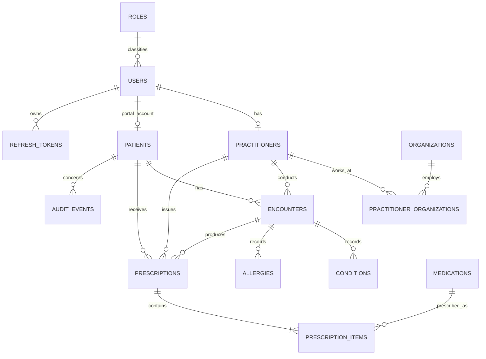

Academic MySQL Data Model — EHR and Electronic-Prescription System

1. Scope

This model supports a small academic prototype in which:

- Doctors manage patient profiles, encounters, conditions, allergies, and electronic prescriptions.
- Pharmacists look up patients and see the medications a doctor prescribed.
- Patients view their own health record and electronic prescriptions.
- Administrators manage accounts and organizations.

The schema is limited to the thesis workflow. Unused hospital-EHR tables (appointments, consents, inventory, dispensing, documents, notifications) are not part of the core.

2. Size

The academic core has 14 tables:

Identity and organizations (6)

- roles
- users
- refresh_tokens
- organizations
- practitioners
- practitioner_organizations

Patient and clinical record (4)

- patients
- encounters
- conditions
- allergies

Prescriptions (3)

- medications
- prescriptions
- prescription_items

Accountability (1)

- audit_events

3. Interface-to-database mapping

| Interface element | Database source |
| --- | --- |
| Doctor, pharmacist, patient, administrator users | roles, users |
| Clinic or pharmacy identity | organizations |
| Doctor/pharmacist profile and license | practitioners |
| Professional works at clinic/pharmacy | practitioner_organizations |
| Patient card and profile | patients |
| Recent encounters | encounters |
| Diagnoses/chronic conditions | conditions |
| Allergies and reactions | allergies |
| Medication catalogue | medications |
| Digital prescription header | prescriptions |
| Prescription medication rows | prescription_items |
| Access history / admin activity | audit_events |

4. High-level relationship model

5. Academic design justification

The model is primarily in Third Normal Form:

- Repeating medication rows are separated from prescription headers.
- Practitioner identity is separated from employment at an organization.
- Clinical visits, diagnoses, and allergies are separate records rather than a single notes blob.

A few deliberate snapshots exist in prescription_items. Medication name, strength, and dosage form are copied at issue time so later catalogue edits do not change a historical prescription.

Integrity is enforced with InnoDB, primary and foreign keys, unique constraints, date and quantity checks, and restricted deletion of clinical records.

The national identifier is represented by encrypted ciphertext and a keyed search hash. Refresh tokens are stored only as hashes. Patient accounts are optional; a clinical record can exist before portal activation. Audit events preserve access, denial, and failure evidence.

6. FHIR-inspired conceptual mapping

The database is not a full FHIR server, but the main concepts map cleanly:

| Database concept | FHIR concept |
| --- | --- |
| patients | Patient |
| practitioners | Practitioner |
| practitioner_organizations | PractitionerRole |
| organizations | Organization |
| encounters | Encounter |
| conditions | Condition |
| allergies | AllergyIntolerance |
| prescriptions + prescription_items | MedicationRequest |
| audit_events | AuditEvent |

7. Service-layer rules

- users.role must agree with the practitioner professional role and API action.
- doctor_id may only refer to a doctor.
- The prescription organization must be an active clinic associated with the doctor.
- An issued prescription can be corrected only by the prescribing doctor.
- The patient portal may only access the patient row linked to the authenticated user.
- The application must never write passwords, access tokens, national identifiers, or full medical content into audit logs.

8. Deliberately excluded from the core

Appointments, consents, access grants, vital signs, clinical notes, pharmacy inventory, dispensing, documents, and notifications were omitted so the thesis stays focused on the electronic prescription workflow.
